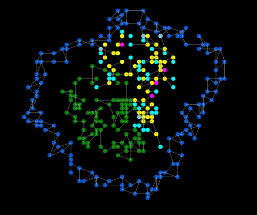
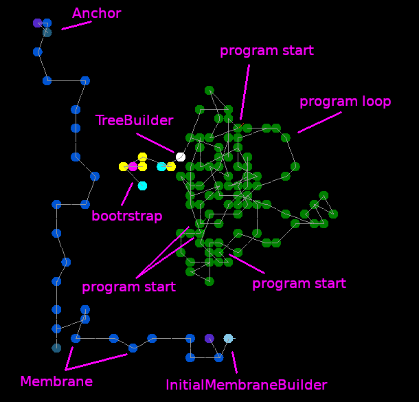

# Overview

This Movable Feast Machine demo is based on [a previous one](https://github.com/mngr777/UlamSimpleTrees).

Three programmable agents are used to build and maintain a 2-layer membrane.
The main idea is to move most of hardcoded behavior to program trees and universal "physical laws" (in this demo -- attraction/repulsion between atoms).
Hardcoded parts are building program trees (`TreeBuilder` element) and setting initial conditions for the demo.

# Setting initial conditions

`Demo` element builds a program loop from `Package` atoms containing program data and attaches a `TreeBuilder` to beginning of "bootstrap" program.  It also creates `DemoInitialMembraneBuilder` that in turn builds the first layer of the membrane around the program loop.

# Programming

Program trees and data sequences are both built from `Package` atoms, packages in a tree have `exec` flag set in their data. Trees are built from sequences by `TreeBuilder` and executed by `Exec`. After a tree is complete, `TreeBuilder` attaches `Exec` atom to the tree and deletes itself.

All programs are stored in program loop. Each program sequence starts with a `Package` atom that has a 1-byte tag value assigned and can be marked as active or inactive (these are marked with a green or red diagonal line in the picture above). The first program is used to build other ones, bootstrapping the whole thing: the agent crawls along the loop, attaches `TreeBuilder`s to active tagged atoms and then deactivates them. The idea was that it can later receive a signal with a tag value to re-activate tagged `Package`s and build more copies, but this is not used in the demo. Other programs are used to build, maintain and grow the membrane.
