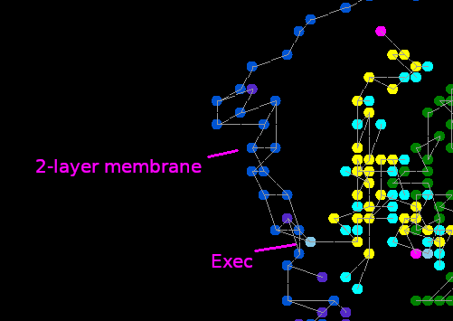

# Overview

This Movable Feast Machine demo is based on [a previous one](https://github.com/mngr777/UlamSimpleTrees).

Three programmable agents are used to build and maintain a 2-layer membrane.
The main idea is to move most of hardcoded behavior to program trees and universal "physical laws" (in this demo -- attraction/repulsion between atoms).
Hardcoded parts are building program trees (`TreeBuilder` element) and setting initial conditions for the demo.

YouTube videos:
* setting up, bootstrapping, starting to build: [video 1](https://www.youtube.com/watch?v=8uURK0usDrE);
* completing the membrane: [video 2](https://www.youtube.com/watch?v=Js69ZdZKyHQ)
* starting multiple cells with `DemoMultiple` element: [video 3](https://www.youtube.com/watch?v=UBMUjet2xU0)

# Building and running
On Ubuntu, intstall `ulam` package (it contains both ULAM and MFM) from PPA, see [ULAM Tutorial](https://github.com/elenasa/ULAM/wiki/Ulam-Programming-Language).  
Or install ULAM and MFM from source: http://robust.cs.unm.edu/doku.php?id=dev:install_ulam. Note that for `develop` branch, `Makefile.local.mk` should use `$ULAM_ROOT_DIR` instead of `$ROOT_DIR`.

After that, running `make` in repo directory will compile `*.ulam` source files and run the result in MFM.

Place a single `Demo` (white `De`) atom to start the demo. To start with multiple cells place `DemoMultiple` (white `DM`) atom.

# Setting initial conditions

`Demo` element builds a program loop from `Package` atoms containing program data and attaches a `TreeBuilder` to beginning of "bootstrap" program.  It also creates `DemoInitialMembraneBuilder` that in turn builds the first layer of the membrane around the program loop.

# Programming

Program trees and data sequences are both built from `Package` atoms, packages in a tree have `exec` flag set in their data. Trees are built from sequences by `TreeBuilder` and executed by `Exec`. After a tree is complete, `TreeBuilder` attaches `Exec` atom to the tree and deletes itself.

All programs are stored in program loop. Each program sequence starts with a `Package` atom that has a 1-byte tag value assigned and can be marked as active or inactive (these are marked with a green or red diagonal line in the picture above). The first program is used to build other ones, bootstrapping the whole thing: the agent crawls along the loop, attaches `TreeBuilder`s to active tagged atoms and then deactivates them. The idea was that it can later receive a signal with a tag value to re-activate tagged `Package`s and build more copies, but this is not used in the demo. Other programs are used to build, maintain and grow the membrane.

Attaching membrane atoms for 2nd layer:

Repairing the membrane using attached atoms:

The last program randomly inserts atoms in the membrane, the other two then attach 2nd layer atom to it and fix the bonds, growing the membrane.

If the membrane is damaged (by manually removing an atom from either layer) it is usually repaired successfully, although sometimes the agents can interfere with each other's work.

Listing of all the programs used in the demo: [Demo.ulam:137](https://github.com/mngr777/UlamMembrane1/blob/master/Demo.ulam#L137).

More details on how program tree is executed: [Exec.ulam:6](https://github.com/mngr777/UlamMembrane1/blob/master/Exec.ulam#L6).

# Physics

Atoms can attract and repulse each other, also the bonds don't like to be stretched to full length (see [ForceUtils.ulam](https://github.com/mngr777/UlamMembrane1/blob/master/ForceUtils.ulam)). When a new site is selected for a diffusable atom, first all the forces acting on the atom are summed up and possible sites are weighed by how similar their positions are to the resulting vector (see [QDiffusableT.ulam:45](https://github.com/mngr777/UlamMembrane1/blob/master/QDiffusableT.ulam#L45)). Exact values and calculations are not very important, just seem to be good enough for the demo.

`Membrane` atoms repulse other `Membrane` atoms and `Package`s. This allows the membrane to keep the contents inside and prevents it from collapsing.
